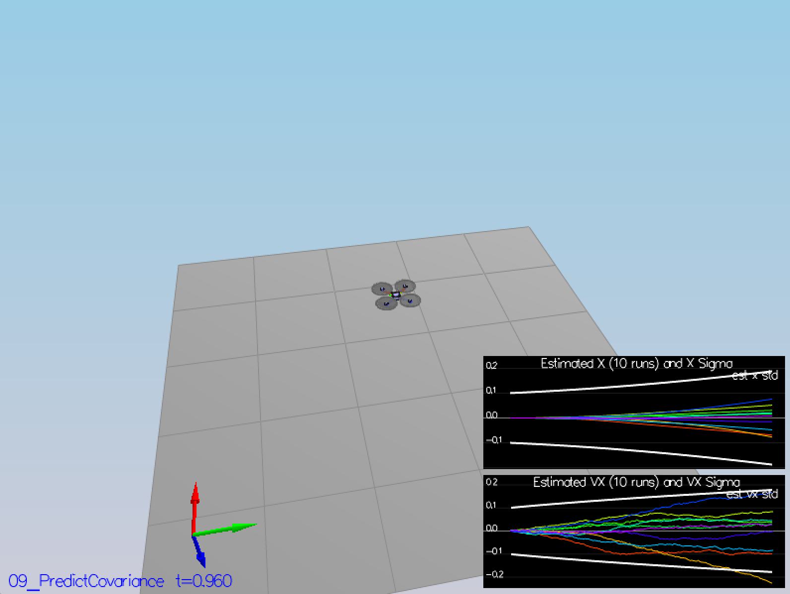

# Project: Building an Estimator
## Write Up

## Step 1 - Sensor Noise
### Scenario 6

### Task

- Your standard deviations should accurately capture the value of approximately 68% of the respective measurements.

### How it was Completed

- To complete this task we changed the following text from 06_SensorNoise.txt
- MeasuredStdDev_GPSPosXY = 2 to .75
- MeasuredStdDev_AccelXY = .1 to .5

```
PASS: ABS(Quad.GPS.X-Quad.Pos.X) was less than MeasuredStdDev_GPSPosXY for 69% of the time
PASS: ABS(Quad.IMU.AX-0.000000) was less than MeasuredStdDev_AccelXY for 68% of the time
```


## Step 2 - Attitude Estimation
### Scenario 7

### Task

- Your attitude estimator needs to get within 0.1 rad for each of the Euler angles for at least 3 seconds.

### How it was Completed

- To get this to pass, we kept the standard QuadControlParams.txt as it is.
- However, we changed kpYaw 3 to .25
- We also changed kpBank 12 to 1

```
PASS: ABS(Quad.Est.E.MaxEuler) was less than 0.100000 for at least 3.000000 seconds
```


## Step 3 - Predict State & Covariance
### Scenario 8 & 9 

### Task

- This step doesn't have any specific measurable criteria being checked.

### How it was Completed

- Kept it as it is from previously and gave the results we needed, since we are not trying to meet a criteria.

```
Scenario 8
None
Scenario 9
None.
```




## Step 4 - Magnetometer Update
### Scenario 10

### Task

- Your goal is to both have an estimated standard deviation that accurately captures the error and maintain an error of less than 0.1rad in heading for at least 10 seconds of the simulation.

### How it was Completed

- Had to tweak the code and reversed the params back to orginal parameters from Udacity

```
PASS: ABS(Quad.Est.E.Yaw) was less than 0.120000 for at least 10.000000 seconds
PASS: ABS(Quad.Est.E.Yaw-0.000000) was less than Quad.Est.S.Yaw for 66% of the time
```


## Step 5 - Closed Loop + GPS Update
### Scenario 11

### Task

- Your objective is to complete the entire simulation cycle with estimated position error of < 1m.

### How it was Completed

- Had to tweak my code with hprime to 1, inside update from gps. But left parameters as it is.

```
PASS: ABS(Quad.Est.E.Pos) was less than 1.000000 for at least 20.000000 seconds
```


## Step 6 - Adding Your Controller

### Task

- Your objective is to complete the entire simulation cycle with estimated position error of < 1m.

### How it was Completed

- The full controller has been tweaked and code been edited. Run the project to see the simulator.

# Building an Estimator Write Up

## UpdateFromIMU - (Update From Inertial Measurement Unit)

- Took the formula from Estimation for Quadrotors 43 - 45 and created the answer below

```
  Quaternion<float> q = Quaternion<float>::FromEuler123_RPY(rollEst, pitchEst, ekfState(6));
  Quaternion<float> dq;
  dq.IntegrateBodyRate(gyro, dtIMU);
  Quaternion<float> qt = dq * q;

  float predictedPitch = qt.Pitch();
  float predictedRoll = qt.Roll();
  ekfState(6) = qt.Yaw();

  if (ekfState(6) > F_PI) ekfState(6) -= 2.f * F_PI;
  if (ekfState(6) < -F_PI) ekfState(6) += 2.f * F_PI;
```

## PredictState

```
  predictedState(0) += predictedState(3) * dt;
  predictedState(1) += predictedState(4) * dt;
  predictedState(2) += predictedState(5) * dt;
  V3F accel2 = attitude.Rotate_BtoI(accel);
  predictedState(3) += accel2.x * dt;
  predictedState(4) += accel2.y * dt;
  predictedState(5) += (accel2.z - CONST_GRAVITY) * dt;
```

## GetRbgPrime

- Taken formula 52 from Estimation for Quadrotors

```
  RbgPrime(0, 0) = −cos(roll) * sin(yaw);
  RbgPrime(0, 1) = −sin(roll) * sin(roll) * sin(yaw) − cos(roll) * cos(yaw);
  RbgPrime(0, 2) = −cos(roll) * sin(roll) * sin(yaw) + sin(roll) * cos(yaw);
  RbgPrime(1, 0) =  cos(roll) * cos(yaw);
  RbgPrime(1, 1) =  sin(roll) * sin(roll) * cos(yaw) − cos(roll) * sin(yaw);
  RbgPrime(1, 2) =  cos(roll) * sin(roll) * cos(yaw) + sin(roll) * sin(yaw);
  RbgPrime(2, 0) =  0;
  RbgPrime(2, 1) =  0;
  RbgPrime(2, 2) =  0;
```

## Predict

- Took the formula 51 from Estimation for Quadrotors

```
  gPrime(0, 0) = 1;
  gPrime(0, 3) = dt;
  gPrime(1, 1) = 1;
  gPrime(1, 4) = dt;
  gPrime(2, 2) = 1;
  gPrime(2, 5) = dt;
  gPrime(3, 3) = 1;
  gPrime(3, 6) = RbgPrime(0) * accel.x * dt;
  gPrime(4, 4) = 1;
  gPrime(4, 6) = RbgPrime(1) * accel.y * dt;
  gPrime(5, 5) = 1;
  gPrime(5, 6) = RbgPrime(2) * accel.z * dt;
  gPrime(6, 6) = 1;

  ekfCov = gPrime * ekfCov * gPrime.transpose() + Q;
```

## UpdateFromGPS

- The GPS measurement formula is below

```
  zFromX(0) = ekfState(0);
  zFromX(1) = ekfState(1);
  zFromX(2) = ekfState(2);
  zFromX(3) = ekfState(3);
  zFromX(4) = ekfState(4);
  zFromX(5) = ekfState(5);

  for(int i = 0; i < 6; i++) {
    hPrime(i, i) = 1;
  }
```

## UpdateFromMag

- The formula for updating the magnetomer is below

```
  zFromX(0) = ekfState(6);
  float yaw_diff = magYaw - ekfState(6);

  if (yaw_diff > F_PI) {
    zFromX(0) += 2 * F_PI;
  } else if (yaw_diff < -F_PI) {
    zFromX(0) -= 2 * F_PI;
  }
  hPrime(6) = 1;
```
